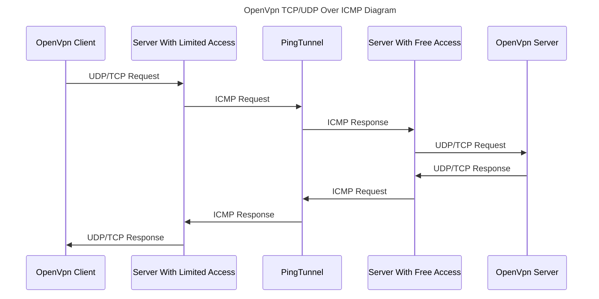
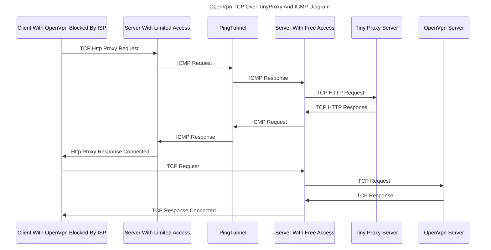

# OpenVPN Over ICMP: Secure Tunnel With ICMP (PING) 
## 📚 Table of Contents
- [🧭 Overview](#-overview)
- [✨ Features](#-features)
- [🧱 Requirements](#-requirements)
- [🚀 Getting Started](#-getting-started)
- [🔐 Connection Flow](#-connection-flow)
- [📜 License](#-license)
- [👤 Author](#-author)
- 
## 🧭 Overview
This project enables tunneling OpenVPN (TCP/UDP) traffic through ICMP (Ping) packets using Docker and PingTunnel. It is ideal for bypassing firewalls or networks where only ICMP is allowed. The system deploys OpenVPN and TinyProxy via Docker and establishes a secure tunnel between client and server.

## ✨ Features
- Tunnel OpenVPN via ICMP (PingTunnel)
- Dockerized server and client configurations
- Supports both TCP (with TinyProxy like seamless and without it) and UDP OpenVPN modes
- Easy setup with Docker Compose scripts
- Designed for use in restricted network environments


This project provides a Docker-based setup to deploy an OpenVPN server (TCP/UDP), TinyProxy HTTP proxy, and PingTunnel to bypass restrictive networks using ICMP tunneling. It includes both server-side and client-side configurations.

## 🧱 Requirements

- Docker & Docker Compose
- Root privileges (for tunneling and VPN)
- Public server with ICMP allowed (for PingTunnel)

## 🚀 Getting Started

### 1. Install Docker on both server and client (server with limited)

If you don't have Docker installed, you can quickly install it using the official convenience script:

```bash
curl -fsSL https://get.docker.com -o get-docker.sh
chmod +x get-docker.sh
sh get-docker.sh
```
### 2. Clone the Repository

```bash
git clone https://github.com/arezaie14/openvpn.git
cd openvpn
```

### 3. Setup Environment Files

Just copy `.env.example` inside folders with below command then edit both files according to your environment.

On server with internet:
```bash
cd ./server
cp ./.env.example ./.env
```
On server with limited internet:
```bash
cd ./client
cp ./.env.example ./.env
```

#### Environment Variables Explanation:
- `SERVER_ADDRESS`: Ip address of server with internet access.
- `OVPN_PORT`: Open vpn public port.
- `PASSWORD`: Password to use when tunneling pingtunnel it can between 0-2147483647.
- `PROXY_PORT`: TinyPorxy public port.
- `PROXY_USER`: TinyPorxy username.
- `PROXY_PASS`: TinyPorxy password.
- `OVPN_TCP_SERVER_ADDRESS`: IP address to config OpenVpn in TCP mode (When using tinyproxy it can be IP of server with internet access else it can be IP of server limited internet access).
- `OVPN_UDP_SERVER_ADDRESS`: IP address to config OpenVpn in UDP mode it's the server with limited internet access.


### 4. Start the Server With Internet Access

```bash
chmod +x ./run.server.sh
./run.server.sh
```

### 5. Start the Server With Limited Internet Access

```bash
chmod +x ./run.client.sh
./run.client.sh
```

## 🪄  Usage

### Add VPN Client To TCP Open Vpn Server:

```bash
docker exec -it openvpn-tcp bash /ovpn-add-client.sh
```
### You can download the client configuration file from ./server/ovpn/openvpn-tcp-data/confs directory after running the above command.

### Add VPN Client To UDP Open Vpn Server:
```bash
docker exec -it openvpn-udp bash /ovpn-add-client.sh
```
### You can download the client configuration file from ./server/ovpn/openvpn-udp-data/confs directory after running the above command.

## 🔌 Connection flow

### OpenVPN TCP/UDP Flow


### OpenVPN TCP With TinyProxy Flow


## 📜 License

Please Visit [MIT License](https://github.com/arezaie14/openvpn-over-icmp/blob/main/LICENSE)

## Special Thanks To: 
### [Ping Tunnel Service](https://github.com/esrrhs/pingtunnel)
### [Vimagick Docker Image](https://hub.docker.com/r/vimagick/tinyproxy)
### [Kylemanna OpenVpn Docker Image](https://github.com/kylemanna/docker-openvpn)

## 👤 Author

**Amin Rezaie**  
📧 Email: [arezaie14@gmail.com](mailto:arezaie14@gmail.com)  
🔗 GitHub: [github.com/arezaie14](https://github.com/arezaie14)

If you find this project useful, feel free to ⭐ star it and share it with others!

## 🤝 Contributions

Pull requests and issues are welcome!
